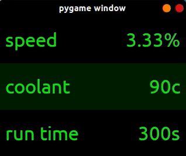

# Pinostic
Vehicle onboard-diagnostic (OBD) assisant built specifically for the PiGRRL Zero.



# Overview
Pinostic is a simple GUI tool written in python with the intention of being used on a piGRRL Zero [(link)](https://learn.adafruit.com/pigrrl-zero/overview). It can feasibly be used on any linux distribution with the only pre-requisits being the following:

### Hardware
* Generic ELM327 OBD to Serial Adapter
* A car with an OBD port
### Software
* python3
* python modules:
    * obd
    * pygame2

### PiGRRL Setup
If you happen to have a PiGRRL you can follow these steps to achieve the same setup I am rocking:
1. Obtain the latest rasbian lite image [(link)](https://www.raspberrypi.org/downloads/raspberry-pi-os/)
2. Write the image to your sd card using your preferred method, e.g:
    ```console
    dd bs=4M if=/path/to/lite.img of=/dev/sdX conv=fsync status=progress
    ```
3. You can create an empty file on the root of the FAT32 partition on your SD card called 'ssh' to automatically enable SSH at boot.
4. SSH onto the pi zero (I used an otg cable connected to USB ethernet adapter). Look at the pi LED's to make sure its doing stuff as we don't have screen output yet
5. If you don't care to install retropie then just follow the generic adafruit TFT easy install to setup the TFT display as a raw framebuffer device [(link)](https://learn.adafruit.com/adafruit-2-2-pitft-hat-320-240-primary-display-for-raspberry-pi/easy-install).
6. Else just follow the piGRRL manual software tutorial [(link)](https://learn.adafruit.com/pigrrl-zero/software-manual-1). Follow the keypress (retropad) setup regardless of what driver you install
7. Install python dependancies:
  ```console
  sudo apt update
  sudo apt install python3 pip3
  python3 -m pip install pygame==2.0.0.dev6 obd
  ```
8. Clone my repo and run as sudo (framebuffer access needs root)
  ```console
  git clone https://github.com/kennedn/pinostic.git
  cd pinostic
  sudo python3 pinostic
  ```

### Features
#### Implemented
* Menu view - monitor multiple commands at once
* Graph view - shows change in command values over time
* Record and export graph data to CSV
#### To be implemented
* Load and store Menu metrics in JSON file
* Load and store keybindings in JSON file
* Customise Menu metrics from within the GUI
